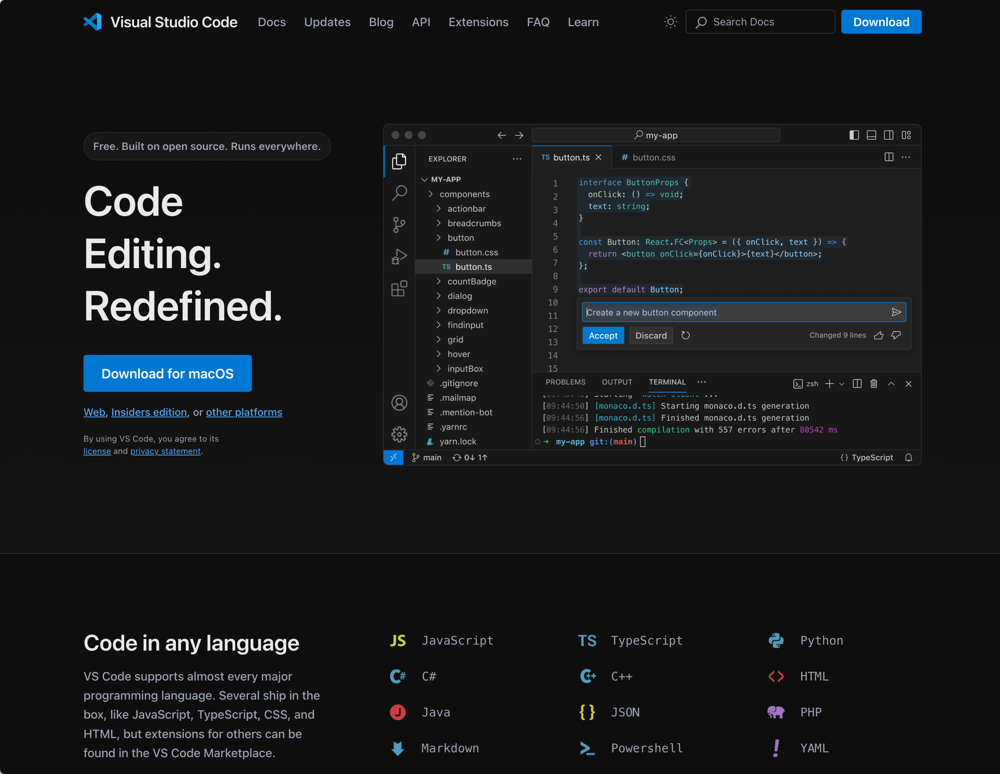
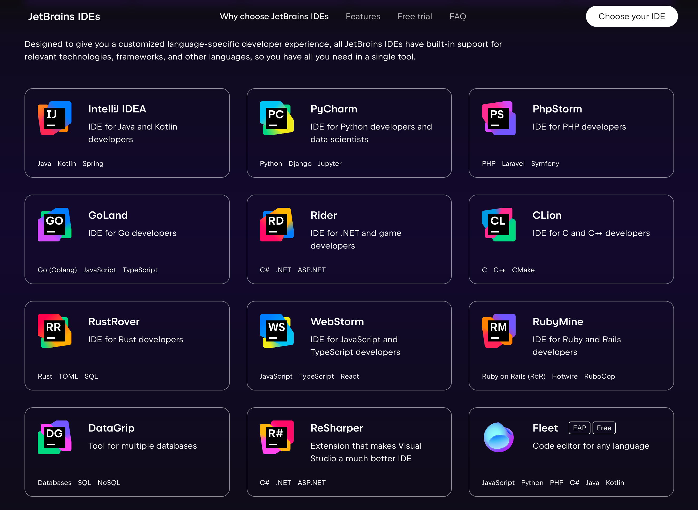

山西大学作为一所非985、211高校，学校的教学质量和学术氛围相对较弱，可能你的舍友每天会打游戏、看电视剧，可能你的老师会敷衍了事、不负责任，可能你的同学会考试作弊、抄袭论文。

不要等到毕业时才后悔，不要等到工作时才发现自己的能力不足，不要等到社会竞争激烈时才感到无助。所以我们要自救，积极主动地提升自己的学术水平和综合素质，为未来的发展打下坚实的基础。

你可以通过自己的努力和学习，打破这种局限，提升自己的学术水平和综合素质。以下是我给大一新生的一些建议：

## 1. 课程

很多大学生可能已经熟练了手机的使用，但是对计算机的基本原理和编程技能却一窍不通。很多计算机专业的同学可能仍然不知道如何卸载软件、如何安装系统、如何编写代码。这是一个非常严重的问题，因为计算机已经成为了我们生活和工作的重要工具，如果你不懂计算机，那么你将会被淘汰。但是，不要担心，我们可以通过学习一些课程来提升自己的计算机技能。

### CS50

课程链接：[CS50](https://www.bilibili.com/video/BV16k4y1X7KZ)
CS50是哈佛大学的一门计算机科学入门课程，涵盖了计算机科学的基础知识和编程技能。作为大一新生，有很多基础概念和技能需要学习，CS50可以帮助你快速入门，掌握基本的编程技能。入门之后，你可以根据自己的兴趣和需求选择更深入的课程。

课程涵盖了计算机科学的基础知识和编程技能，从“小学生”编程软件Scratch到C语言，再到Python、JavaScript等高级语言，涵盖了计算机科学的基础知识和各种编程思想。老师Malan风趣幽默，看完第一节课就会被他的授课风格所吸引。同时，Harvard的学术氛围也会让你感受到一种愉悦快乐的学习的氛围。

课程目录：Scratch、C、Arrays、Algorithms、Memory、Data Structures、Python、Artificial Intelligence、SQL、HTML、CSS、JavaScript、Flask、Cybersecurity

## 2. 书籍

书籍是人类进步的阶梯，这句话你可能已经听过无数遍了，但是你真的能静下心来翻开第一页开始阅读吗？很多人可能会觉得读书太枯燥、太枯燥、不容易理解。其实，读书是获取知识最可靠最有效的途径，网上的学习资源参差不齐，甚至CSDN上的博客可能一派胡言，练基本运行都无法通过。而一本经典的书籍，是无数人的智慧结晶，是无数人的心血之作。那些国外的资深大佬写的经典之作，是每个入门者最好的导师。不要担心看不懂，不要担心看不进去，不要担心看不完，只要你开始了，你就已经走在了成功的路上。如果你真的看不懂，可以先跳过，或者在群里提问，或者在网上搜索，总会有人帮助你的。

### 《C Primer Plus》

《C Primer Plus》是一本经典的C语言入门教程，适合初学者阅读。这本书详细介绍了C语言的基本概念和语法规则，适合初学者阅读。通过阅读这本书，你可以快速掌握C语言的基本知识和编程技能，为以后学习更深入的计算机科学知识打下坚实的基础。

### 《Python编程：从入门到实践(第2版)》

Python作为2024年编程语言排行榜之首，是当之无愧的编程语言之王。可能一开始你的学校不会开设Python课程，但是你学会了Python，你就获得了计算机的瑞士军刀。你可以用短短几行代码实现爬虫、GPT、网站、批处理脚本等。这本书的语言浅显易懂，就像教小学生一样，适合初学者阅读。

## 3. 实践

实践是检验真理的唯一标准。计算机如果不实践，只会纸上谈兵，那他只能是你眼前的一块废铁。在大学，学好计算机可以帮助你更高效的完成你想完成的任务。

### 学会魔法

这件事是每一个计算机同学*最最最重要*的技能，是开启计算机世界大门的钥匙。学会魔法后，你可以探索更加广阔的计算机资源，不再是井底之蛙。但是由于某些原因，这个不能在这个网站上解释清楚，但是你一定要弄明白是什么意思，不然你的进步可能永远停滞不前，动力不足。你可以在网上和学长们提问，如何学会魔法，探索普通人无法看到的世界。目前最新的方法是：原神，启动！（mihomo），但是随着时间的推移，可能会更新换代。如果你看不懂，可以去群里问学长，也可以bing搜索“计算机上网魔法”。

### 学会解决问题的能力

你可能曾经试过向大牛提问，但是这些提问往往石沉大海。于是你就纳闷了：这些大牛们平时在网上看都性格好好和蔼可亲的样子，怎么一向他们提问变得那么冷漠了？反差实在是太大了。

其实，出现这样的情况，往往不是对方耍大牌，而是你提问的方式错了。这篇文章让大家了解几个原则，让你更好地提问，并获得高回复率。

#### 原则一、向适当的人提问适当的问题。

大牛们喜欢艰巨的任务和激发思考的好问题。如果你提的问题在百度知道都可以找到答案，就莫怪他们鄙视你了，你也应该反省一下，你自己为什么那么懒？这些懒人们在高手眼中就像是蛀虫一样，本来大牛们的时间就不多，与其回答你的傻问题，不如花时间去回答其他更有意义的问题。

#### 原则二、提问前先搜一搜。

将你的问题放进搜索引擎过滤一遍，这其实不是什么难事，事实证明，90%的问题都可以用搜索引擎解决了，Bing 不行，用 Google，Google 不行用知乎。当然，我们不建议使用百度或是 CSDN。

> Q：什么？怎么搜索？！
> A：这里刚好有一篇《十大高明的 Google 搜索技巧》，拿去用吧。
> Q：什么？链接在哪里？！
> A：看原则二！

#### 原则三、提问前先试试自己解决。

如果你的问题在网络上找不到答案，你也需要自行思考试图解决，解决不了，再向大牛们提问。大牛们喜欢看勤于思考、喜欢自己动手的人，不要以为你可以随便地忽悠大牛，大牛们的经验比你丰富，一眼就可以看得出你对待问题的态度。所以，认真地思考，准备好你的问题。

#### 原则四、准确地描述问题。

问题的描述应该包含以下内容：

清晰的细节；

问题发生的背景；

提问前做过的调查研究及对其的理解；

提问前为确定问题而采取的诊断步骤；

注意：千万不要用什么「跪求」，「在线等」，「紧急」等之类哗众取宠的词语来吸引大牛的注意，在大牛们看来，这些问题根本不值得去回答。

#### 原则五、问题解决后向大牛汇报一下结果。

别的不说，别人帮你解决了问题，你得向别人说声谢谢吧，这是最基本的礼节。

如果你厚道的话，也可以将解决问题的过程写下来，让以后有问题的人不要重蹈覆辙。这个举动不仅是在总结经验，而且是在为自己攒人品，大牛们看到你的总结会欣赏你的作为，以后就更加喜欢回答你的问题，说不定你以后还有机会和大牛们吃吃饭呢。

好吧，就说到这里，感谢 Eric S. Raymond，感谢知乎，感谢搜索引擎们。如果你能按以上的五个原则提问，这个世界真的会少很多的噪音，也少了很多抱怨，算是为人类造福了。

### 学习C语言

很多大学生第一件事就是开始学习C语言，这是一个非常正确的选择。C语言是所有编程语言的祖师爷，学好了C语言，其他编程语言就是小菜一碟。
学习 C 语言的时候不要进入死角，去纠结  i++++、++i，掌握基本的循环、判断、函数后就可以多写一些课后练习题，然后重点学习内存、指针。
这里推荐经典书籍和翁凯老师的 C 语言课程。
发布在在大学 MOOC ，翁恺老师的讲述特别简单易懂，适合初学者。
1. 《C Primer Plus（第六版）》- Stephen Prata
2. 《C 程序设计语言》- Brian W. Kernighan & Dennis M. Ritchie
3. [C 语言程序入门](https://www.icourse163.org/course/0809ZJU007-90010)
4. [C 语言程序进阶](https://www.icourse163.org/course/0809ZJU007B-200001)

边学边练，很重要！推荐刷完洛谷的入门题单，然后再刷一些基础题，比如说指针、数组、字符串等等。
[洛谷入门题单](https://www.luogu.com.cn/training/list)

不懂就搜bing，搜不到就问，记得提问前先看上面的提问方法，否则大佬们可能会直接忽略你的问题。

#### RTFM 与 STFW
RTFM 是 Read The Fucking Manual 的意思，STFW 是 Search The Fucking Web 的意思。这两个字面意思看完其实就理解了，但会被缩成短语即说明其使用的频率之高。也说明了现代人类大部分人经常会问 Stupid 的问题，而不是先尝试过一些想法后再提问。

RTFM 与 STFW 包含着这样的意思：在寻求帮助之前，先尽自己最大的努力自行解决。因此，你可以在下面这两种场景时使用它：

当别人询问你一个简单的、未经思考的问题时，你可以回应他：“RTFM”，表示让他先自己查查资料、自行解决；
在你寻求他人的帮助时，你可以告诉他你已经 RTFM 很久了，这时他便不会轻易拒绝你；
RTFM 与 STFW 的思想不仅仅适用于 unix 和 linux 文化，它适用于任何方面，尤其是 IT 和互联网圈子。在寻求他人帮助之前先自行解决，不要把他人当成“活字典”使用，这应该成为最基本的礼貌。

未经过 RTFM 就寻求到的帮助往往也比较流于表面，难以获取真正有价值的内容。反过来，如果你 RTFM 后再寻求帮助，别人也更愿意解答你的问题，因为解答这样的问题可以引发更深入的思考、增长知识和见识，还可以帮助他人，何乐不为呢！

### GitHub 和 Stack Overflow

[GitHub](https://github.com/)是世界上最大的开源代码网站，里面有来自全球各地的顶级程序员的优秀大作，在这里，你可以融入到世界程序员的氛围中，对他们的代码做出评价（提issue）、做出修复或者改进（提PR）、赞扬或者追星（star & follow），越早融入这个程序员圈子，你就能越早成为一名优秀的“大佬”。也欢迎大家给我的GitHub点点Follow，给我的项目点点Star，谢谢(>_<)。[我的GitHub个人主页](https://github.com/stepbystepcode)

[Stack Overflow](https://stackoverflow.com/)是世界上最大的程序员讨论社区，在这里，你可以向世界各地的程序员大牛提问，你的提问也会很快被回复，和世界上的程序员成为朋友。相信他们是你学习路上的坚实引领者。[我的Stack Overflow个人主页](https://stackoverflow.com/users/13987501/li-jing)

### 远离百度、CSDN

我们都知道，在学习和项目中，经常需要查找各种资料和解决方案。然而，百度和CSDN这些平台上充斥着大量广告和低质量、甚至错误的信息，常常让我们在寻找答案时耗费大量时间，且效果不佳。

在这里，我强烈建议大家多使用Bing进行搜索。Bing的搜索结果更加清晰和精准，减少了广告的干扰，让我们更快地找到所需的信息。此外，当你们遇到技术问题时，Stack Overflow是一个非常值得信赖的平台。这个社区汇聚了全球的技术专家，提供了大量高质量的解答和讨论，能帮助你们迅速解决问题。

我还想提醒大家，尽量减少对英文的抵触心理。虽然简中互联网上有丰富的资源，但信息的质量参差不齐，往往需要花费更多时间去筛选和验证。可能你图省事，在CSDN上复制粘贴了一个XXX系统代码，粘贴到本地出现了上百个报错，根本无法运行。而英文资源，尤其是国际上的主流技术社区和文档，通常更加权威和准确。融入世界程序员的圈子，不仅能提高我们的技术水平，还能开阔视野，了解最新的行业动态和趋势。

希望你们在学习和研究中能更加高效，少走弯路。远离那些充满垃圾信息的平台，积极学习英语，勇敢融入全球开发者社区，让我们一起追求更高的信息质量和学习效率！

### 积极学习英语、提升打字速度

英语是计算机领域的通用语言，掌握英语能力可以让你更好地阅读和理解国外的技术文档、论文和资料。早日通过英语四六级考试，或者通过托福、雅思等考试，提升自己的英语水平，是非常重要的。

提升打字速度可以让你更快地输入代码和文档，提高工作效率。打字就像是程序员的走路技能，如果你的打字速度很慢，那么你的工作效率就会大大降低，事倍功半。在这里，推荐一个打字练习网站：[Typing Club](https://www.typingclub.com/sportal/program-3.game)，他从入门者的角度教你如何正确使用键盘高效打字，而且每一关都有奖励机制和趣味性，你可以在玩中练习打字，提高自己的打字速度。

### 早日使用Mac或者Linux

我由衷地建议大家尽早使用MacOS和Linux操作系统,远离Windows。这不仅是出于专业发展的考虑,也是出于对你们未来成长的关切。

首先,在软件环境的安装和运维方面,MacOS和Linux系统都有着极大的便利性。它们提供了丰富的开源软件生态,大部分常用的开发工具和框架都可以轻松安装和配置。相比之下,Windows系统则常常需要繁琐的兼容性检查和驱动程序安装,给开发和维护带来不少麻烦。

其次,MacOS和Linux系统都具有出色的系统稳定性和安全性。它们基于Unix内核,拥有强大的多任务处理能力和内存管理机制,能够更好地保护系统免受病毒和黑客攻击。这对于从事软件开发、网络安全等工作的同学来说,无疑是一大优势。

还有，MacOS的续航能力和性能表现也是非常出色的。MacBook系列的笔记本电脑,不仅拥有优秀的续航能力,还具备强大的性能表现。这对于长时间的编程和开发工作来说,是非常重要的。如果你选择了Windows，那么你可能需要背着像板砖一样的电源适配器去找插座，上课时如果忘记充电，那么你的电脑可能会在课堂上关机，而且不插电源的情况下，Windows的性能表现也会大打折扣。

我知道,MacBook的价格看起来可能比Windows笔记本要高一些,但是其性价比绝对是物有所值。国内99%的大型互联网公司都在使用MacOS系统,这不仅是因为它能提高工作效率,也是因为它优秀的稳定性和对程序开发的友好性。大家没必要选择最高配的MacBook,只要选择16G内存+512G固态硬盘的配置就足够了。截止2024年7月28日，拼多多14寸的MacBook Pro M1 Pro+16G内存+512G固态硬盘的价格是8000左右。618和双十一的时候，可能还会有更低的价格。

所以,我真诚地建议各位学弟,能够尽早购买一台MacBook,或者至少在学习和工作中大量使用Linux系统。相信通过自己的不断探索和实践,你们一定能够在这些先进的操作系统上收获意想不到的成果。

### 早日使用Vim、VSCode、JetBrains

编程软件是程序员的利器，选择一款适合自己的编程软件，可以提高工作效率，减少出错率。在这里，我推荐几款优秀的编程软件：

- Vim是我最喜欢的编辑器，没有之一。不管我使用什么操作系统，我都会第一时间安装Vim。不管我使用什么编程软件，我都会安装vim插件以启用vim功能。这是因为vim高效的键位只需要下功夫记忆，就可以让你的编程效率提高数倍。在这里，我推荐一个学习vim的视频教程：[Vim入门教程1](https://www.bilibili.com/video/BV164411P7tw) [Vim入门教程2](https://www.bilibili.com/video/av55664166/) [Vim入门教程3](https://www.bilibili.com/video/BV1r4411G7de/?vd_source=e8f45c8a3793e6e84c5876844e745571)。通过这个教程，你可以快速掌握vim的基本操作，提高自己的编程效率。实践没必要完全按照他的操作，你只需要安装一个[LazyVim](https://www.lazyvim.org/)，或者在你的编程软件中安装vim插件，就可以使用vim的快捷键了。

- VSCode：VSCode是一款轻量级的现代化代码编辑器，支持多种编程语言，具有丰富的插件和主题，可以满足你的各种编程需求。VSCode的界面简洁清晰，操作简单方便，是很多程序员的首选编辑器。下载地址：[VSCode](https://code.visualstudio.com/)

- JetBrains：JetBrains是一家专业的软件开发工具提供商，旗下拥有多款优秀的IDE，如IntelliJ IDEA、PyCharm、WebStorm等。这些IDE具有强大的代码智能提示、调试功能和版本控制功能，可以帮助你更快地开发和调试代码。这个软件是收费的，但是我们可以通过山西大学的企业微信邮箱来获得免费使用的资格，这个羊毛越早薅到就是赚到。如果你需要开发大型项目，那么JetBrains的针对性IDE就是最好的选择，如Java就用IDEA，Python就用PyCharm，前端就用WebStorm。下载地址：[JetBrains](https://www.jetbrains.com/)

感谢你能看到这里，希望这些建议对你有所帮助。如果你看到了这篇文章并开始付出行动，那么你就已经走在了成功的路上。
在大学的学习生活中，不要被琐事和娱乐所迷惑，要保持学习的热情和动力，不断提升自己的学术水平和综合素质，为未来的发展打下坚实的基础。祝你学业有成，前程似锦！